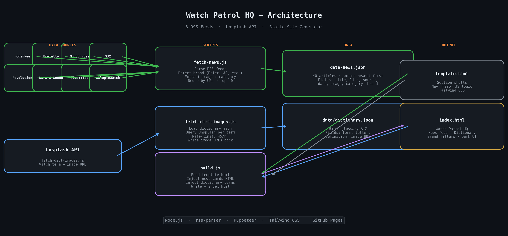

# Watch Patrol HQ

A static luxury watch enthusiast site that aggregates news from 8 top watch media RSS feeds and serves a curated A-Z watch glossary — rebuilt on every run with a Node.js static site generator.



## What It Does

1. **Fetches news** from 8 watch media RSS feeds — Hodinkee, Fratello, Monochrome, SJX, Revolution, Worn & Wound, Time+Tide, aBlogtoWatch
2. **Detects brand** per article (Rolex, Omega, Patek, AP, JLC, Cartier, Tudor, IWC) from title and tags
3. **Deduplicates and sorts** by publish date, keeping the top 40 articles → `data/news.json`
4. **Fetches dictionary images** from Unsplash — one image per watch glossary term
5. **Builds the site** — injects news cards and glossary terms into `template.html` → `index.html`

## Site Features

- **News feed** — filterable by brand, with featured hero card and article grid
- **Watch Dictionary** — A-Z glossary of watch terms with images and definitions
- **Dark UI** — custom dark theme with gold accents using Tailwind CSS
- **Brand filters** — filter news by Rolex, Omega, Patek, AP, JLC, Cartier, Tudor, IWC, or show all

## Scripts

| Script | What it does |
|---|---|
| `scripts/fetch-news.js` | Fetches all RSS feeds, extracts images, detects brands, deduplicates, writes `data/news.json` |
| `scripts/fetch-dict-images.js` | Queries Unsplash for each dictionary term and saves image URLs into `data/dictionary.json` |
| `scripts/build.js` | Reads `template.html` + data files, generates full `index.html` |

## Setup

### 1. Install dependencies

```bash
npm install
```

### 2. (Optional) Unsplash API key — for dictionary images

```bash
export UNSPLASH_ACCESS_KEY=your_key_here
```

Without it, `fetch-dict-images.js` exits cleanly and the dictionary uses existing images.

## Usage

```bash
# Fetch latest watch news
node scripts/fetch-news.js

# (Optional) Refresh dictionary images
node scripts/fetch-dict-images.js

# Build the site
node scripts/build.js
```

Or run all three in sequence:

```bash
node scripts/fetch-news.js && node scripts/fetch-dict-images.js && node scripts/build.js
```

The output is `index.html` — open it in a browser or deploy to GitHub Pages.

## Adding RSS Feeds

Edit the `FEEDS` array in `scripts/fetch-news.js`:

```js
const FEEDS = [
  { url: 'https://example.com/feed.xml', source: 'Source Name' },
  // ...
];
```

## Adding Brand Filters

Edit `BRAND_PATTERNS` in `scripts/fetch-news.js`:

```js
const BRAND_PATTERNS = [
  { brand: 'vacheron', patterns: [/\bvacheron\b/i, /\bvc\b/i] },
  // ...
];
```

Then add the corresponding filter button in `template.html`.
